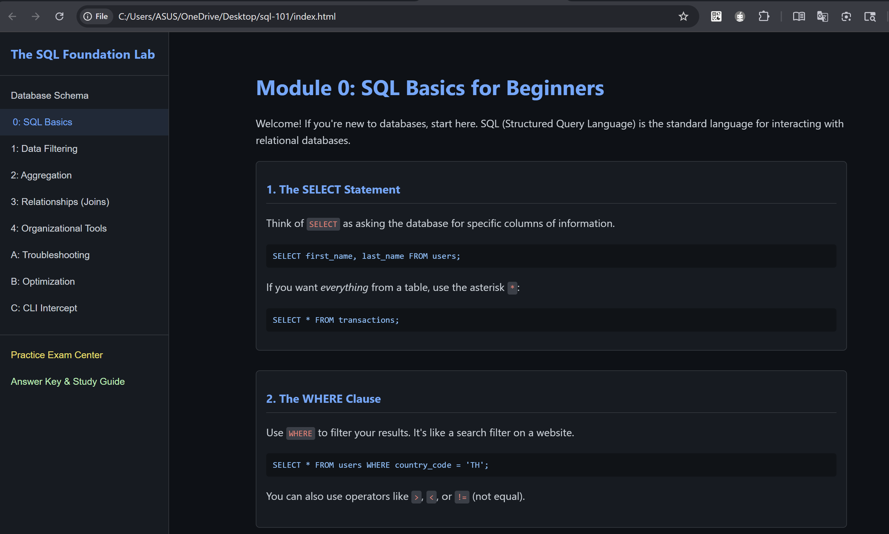
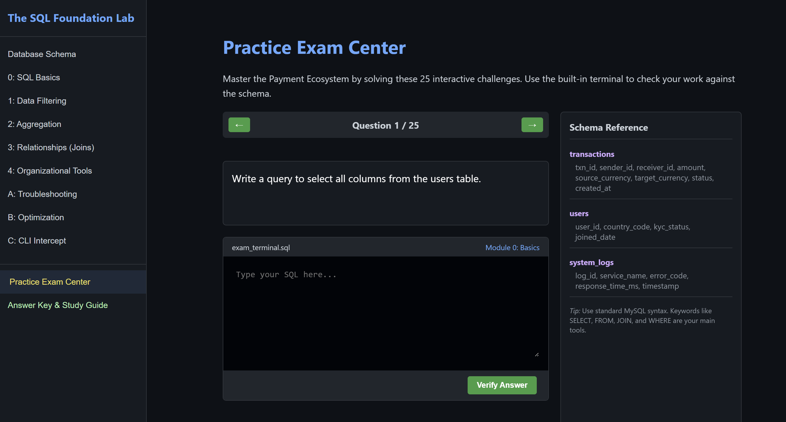

# The SQL Foundation Lab

A fully functional, single-page interactive SQL learning and examination platform for anyone mastering database fundamentals and troubleshooting.

## Overview

**The SQL Foundation Lab** is an interactive learning environment built to bridge the gap between absolute SQL basics and real-world database operations. It uses a mock "Payment Ecosystem" to provide context-rich, practical scenarios for hands-on study. Whether you are a student, a self-learner, or a professional sharpening your skills, this lab offers a structured way to practice queries and diagnostic tools.

## Screenshots

| SQL Basics Module | Interactive Exam Center |
| :---: | :---: |
|  |  |

## Features

- **Interactive Learning Path**: 5 core modules covering the fundamentals:
    - 0: SQL Basics (SELECT, FROM, WHERE)
    - 1: Data Filtering (BETWEEN, LIKE, IN)
    - 2: Aggregation (COUNT, SUM, GROUP BY)
    - 3: Relationships (INNER JOINs)
    - 4: Organizational Tools (ORDER BY, LIMIT, Aliases)
- **Advanced Operations Modules**: Real-world scenarios for IT Support:
    - **Troubleshooting**: Diagnosing failed transactions via complex joins.
    - **Optimization**: Understanding B-Tree indexes and preventing full table scans.
    - **CLI Intercept**: Using Linux (`top`, `htop`) and MySQL (`EXPLAIN`, `PROCESSLIST`) tools.
- **Practice Exam Center**: 25 interactive SQL challenges with an integrated terminal and live schema reference.
- **Self-Study Answer Key**: Detailed solutions and educational breakdowns for every question and module.
- **Zero Configuration**: A single, portable `index.html` file—no database server or installation required.

## Database Context: The Payment Ecosystem

The lab utilizes a consistent schema throughout all modules and exams:
- `transactions`: Core payment data (UUIDs, amounts, currencies, status).
- `users`: Regional data and KYC status.
- `system_logs`: Infrastructure performance and error tracking.

## How to Use

1.  Download the `index.html` file.
2.  Open the file in any modern web browser (Chrome, Firefox, Safari, Edge).
3.  Start with **Module 0** or jump straight into the **Practice Exam Center**.

## Target Audience

- IT Operations & System Administrators.
- Technical Support Engineers.
- Beginners looking for a structured, hands-on SQL environment.

## License

This project is open-source and available for educational purposes.
